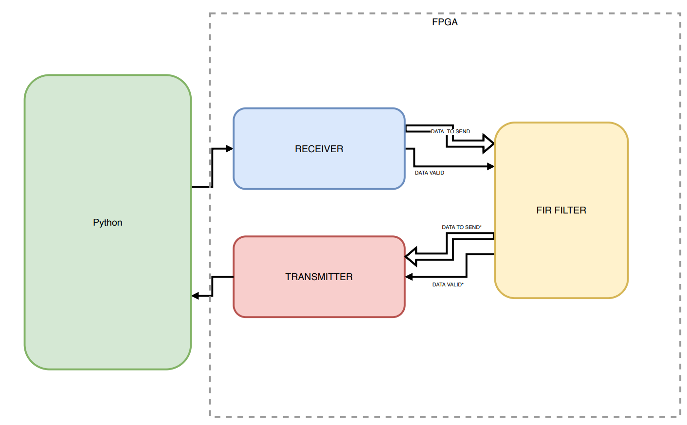

# FIR filter co-processor in FPGA

    

## Authors

* [**Rinaldi Luca**](https://github.com/RinaldiLuca) (University of Padua)
* **Benassi Federica** (University of Bologna)
* **Ghidoni Rebecca** (University of Padua)
* [**Negri Luca**](https://github.com/Luca-Negri) (University of Padua)

## Abstract
In this project we implement a FIR filter co-processor in FPGA (**Arty7**). We test the hardware implementation of the filter on several input waveforms and we compare the results with the ones obtained through a Python simulation.

The assignment of this project can be found [**here**](https://github.com/RinaldiLuca/FIRfilter_on_FPGA/blob/main/Assignment.pdf)

The complete report of this project can be found [**here**](https://github.com/RinaldiLuca/FIRfilter_on_FPGA/blob/main/Report.pdf)
